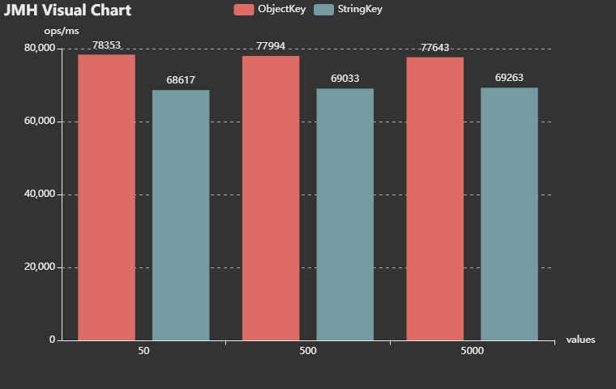

# ObjectKey Benchmarks

使用拼接字符串作为Map的Key和使用数据类作为Key时的差异。

数据: [result.json](result.json)

```
Benchmark                                              (values)   Mode  Cnt      Score      Error   Units
MapKeyTest.ObjectKey                                         50  thrpt    5  78353.500 ± 1212.498  ops/ms
MapKeyTest.ObjectKey:·gc.alloc.rate                          50  thrpt    5   5124.326 ±   79.229  MB/sec
MapKeyTest.ObjectKey:·gc.alloc.rate.norm                     50  thrpt    5     72.016 ±    0.001    B/op
MapKeyTest.ObjectKey:·gc.churn.G1_Eden_Space                 50  thrpt    5   5159.392 ±  165.674  MB/sec
MapKeyTest.ObjectKey:·gc.churn.G1_Eden_Space.norm            50  thrpt    5     72.508 ±    1.949    B/op
MapKeyTest.ObjectKey:·gc.churn.G1_Survivor_Space             50  thrpt    5      0.006 ±    0.002  MB/sec
MapKeyTest.ObjectKey:·gc.churn.G1_Survivor_Space.norm        50  thrpt    5     ≈ 10⁻⁴               B/op
MapKeyTest.ObjectKey:·gc.count                               50  thrpt    5    271.000             counts
MapKeyTest.ObjectKey:·gc.time                                50  thrpt    5    141.000                 ms
MapKeyTest.ObjectKey:·stack                                  50  thrpt             NaN                ---
MapKeyTest.ObjectKey                                        500  thrpt    5  77994.276 ±  347.101  ops/ms
MapKeyTest.ObjectKey:·gc.alloc.rate                         500  thrpt    5   5100.606 ±   22.568  MB/sec
MapKeyTest.ObjectKey:·gc.alloc.rate.norm                    500  thrpt    5     72.016 ±    0.001    B/op
MapKeyTest.ObjectKey:·gc.churn.G1_Eden_Space                500  thrpt    5   5122.830 ±  178.210  MB/sec
MapKeyTest.ObjectKey:·gc.churn.G1_Eden_Space.norm           500  thrpt    5     72.330 ±    2.528    B/op
MapKeyTest.ObjectKey:·gc.churn.G1_Survivor_Space            500  thrpt    5      0.006 ±    0.003  MB/sec
MapKeyTest.ObjectKey:·gc.churn.G1_Survivor_Space.norm       500  thrpt    5     ≈ 10⁻⁴               B/op
MapKeyTest.ObjectKey:·gc.count                              500  thrpt    5    251.000             counts
MapKeyTest.ObjectKey:·gc.time                               500  thrpt    5    133.000                 ms
MapKeyTest.ObjectKey:·stack                                 500  thrpt             NaN                ---
MapKeyTest.ObjectKey                                       5000  thrpt    5  77643.447 ±  571.035  ops/ms
MapKeyTest.ObjectKey:·gc.alloc.rate                        5000  thrpt    5   5077.905 ±   37.386  MB/sec
MapKeyTest.ObjectKey:·gc.alloc.rate.norm                   5000  thrpt    5     72.016 ±    0.001    B/op
MapKeyTest.ObjectKey:·gc.churn.G1_Eden_Space               5000  thrpt    5   5099.964 ±  157.305  MB/sec
MapKeyTest.ObjectKey:·gc.churn.G1_Eden_Space.norm          5000  thrpt    5     72.328 ±    2.033    B/op
MapKeyTest.ObjectKey:·gc.churn.G1_Survivor_Space           5000  thrpt    5      0.006 ±    0.004  MB/sec
MapKeyTest.ObjectKey:·gc.churn.G1_Survivor_Space.norm      5000  thrpt    5     ≈ 10⁻⁴               B/op
MapKeyTest.ObjectKey:·gc.count                             5000  thrpt    5    279.000             counts
MapKeyTest.ObjectKey:·gc.time                              5000  thrpt    5    150.000                 ms
MapKeyTest.ObjectKey:·stack                                5000  thrpt             NaN                ---
MapKeyTest.StringKey                                         50  thrpt    5  68617.747 ± 6429.778  ops/ms
MapKeyTest.StringKey:·gc.alloc.rate                          50  thrpt    5   4986.448 ±  467.294  MB/sec
MapKeyTest.StringKey:·gc.alloc.rate.norm                     50  thrpt    5     80.018 ±    0.002    B/op
MapKeyTest.StringKey:·gc.churn.G1_Eden_Space                 50  thrpt    5   5020.159 ±  474.518  MB/sec
MapKeyTest.StringKey:·gc.churn.G1_Eden_Space.norm            50  thrpt    5     80.561 ±    2.351    B/op
MapKeyTest.StringKey:·gc.churn.G1_Survivor_Space             50  thrpt    5      0.007 ±    0.004  MB/sec
MapKeyTest.StringKey:·gc.churn.G1_Survivor_Space.norm        50  thrpt    5     ≈ 10⁻⁴               B/op
MapKeyTest.StringKey:·gc.count                               50  thrpt    5    308.000             counts
MapKeyTest.StringKey:·gc.time                                50  thrpt    5    151.000                 ms
MapKeyTest.StringKey:·stack                                  50  thrpt             NaN                ---
MapKeyTest.StringKey                                        500  thrpt    5  69033.697 ±  788.638  ops/ms
MapKeyTest.StringKey:·gc.alloc.rate                         500  thrpt    5   5016.438 ±   57.650  MB/sec
MapKeyTest.StringKey:·gc.alloc.rate.norm                    500  thrpt    5     80.018 ±    0.001    B/op
MapKeyTest.StringKey:·gc.churn.G1_Eden_Space                500  thrpt    5   5053.276 ±  137.128  MB/sec
MapKeyTest.StringKey:·gc.churn.G1_Eden_Space.norm           500  thrpt    5     80.606 ±    2.327    B/op
MapKeyTest.StringKey:·gc.churn.G1_Survivor_Space            500  thrpt    5      0.007 ±    0.002  MB/sec
MapKeyTest.StringKey:·gc.churn.G1_Survivor_Space.norm       500  thrpt    5     ≈ 10⁻⁴               B/op
MapKeyTest.StringKey:·gc.count                              500  thrpt    5    319.000             counts
MapKeyTest.StringKey:·gc.time                               500  thrpt    5    170.000                 ms
MapKeyTest.StringKey:·stack                                 500  thrpt             NaN                ---
MapKeyTest.StringKey                                       5000  thrpt    5  69263.109 ±  403.323  ops/ms
MapKeyTest.StringKey:·gc.alloc.rate                        5000  thrpt    5   5033.202 ±   29.852  MB/sec
MapKeyTest.StringKey:·gc.alloc.rate.norm                   5000  thrpt    5     80.018 ±    0.001    B/op
MapKeyTest.StringKey:·gc.churn.G1_Eden_Space               5000  thrpt    5   5082.822 ±  136.166  MB/sec
MapKeyTest.StringKey:·gc.churn.G1_Eden_Space.norm          5000  thrpt    5     80.806 ±    1.747    B/op
MapKeyTest.StringKey:·gc.churn.G1_Survivor_Space           5000  thrpt    5      0.007 ±    0.004  MB/sec
MapKeyTest.StringKey:·gc.churn.G1_Survivor_Space.norm      5000  thrpt    5     ≈ 10⁻⁴               B/op
MapKeyTest.StringKey:·gc.count                             5000  thrpt    5    324.000             counts
MapKeyTest.StringKey:·gc.time                              5000  thrpt    5    168.000                 ms
MapKeyTest.StringKey:·stack                                5000  thrpt             NaN                ---
```

[](result.json)

